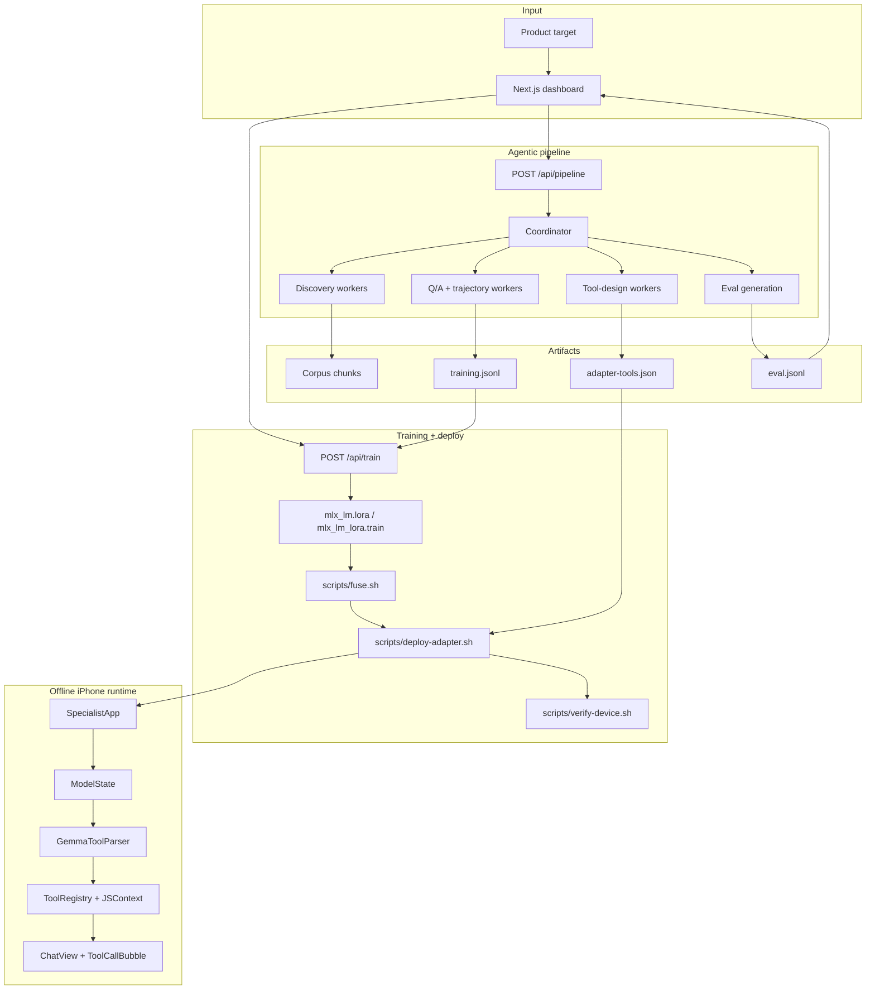
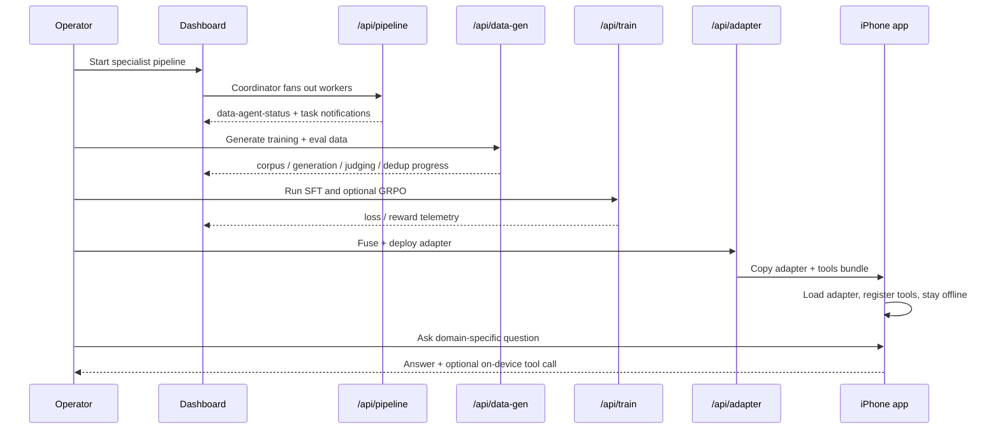
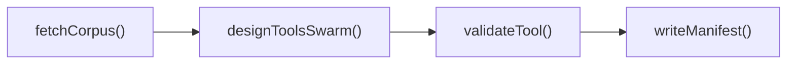

<h1 align="center">Offline Specialist-LLM Pipeline</h1>

<p align="center">
  <strong>Agentic product-to-model pipeline: discovery swarm, dynamic tool design, judge-gated data generation, local MLX fine-tuning, and offline iPhone inference in one deployable demo system</strong>
</p>

<p align="center">
  <video src="assets/recording.mp4" controls playsinline muted width="920"></video>
</p>

<p align="center">
  <video src="assets/recording_mobile.MP4" controls playsinline muted width="360"></video>
</p>

<p align="center">
  <a href="https://github.com/Julian-AT/codex-hackathon"></a>
  
  
  
  
</p>

## Overview

This project takes a product surface and turns it into a narrow specialist model that can run **fully offline on an iPhone**.

The system is intentionally end-to-end. A visible coordinator/worker swarm discovers the product surface, designs callable tools, and synthesizes training data. A local MLX LoRA path fine-tunes the model on a MacBook. The resulting adapter and tool manifest are copied into a native Swift app, where the phone can answer specialist questions and execute bundled JavaScript tools while in **airplane mode**.

## The challenge

Most offline-AI demos quietly weaken the story with hidden retrieval, cloud fallback, or tiny browser models. This project targets the harder version:

- a specialist model, not generic chat
- dynamic tools authored by the agent swarm itself
- local training on consumer hardware
- native mobile inference instead of a fragile web path
- an explicit fallback ladder so the demo survives stage pressure

## Core capabilities

| Track | What ships |
| --- | --- |
| **Swarm** | `/api/pipeline` coordinator/worker orchestration, worker status streaming, dashboard agent grid |
| **Discovery** | product corpus ingestion, tool-design swarm, validation gates, `adapter-tools.json` emission |
| **Data** | grounded Q&A, tool trajectories, eval-set generation, schema-gated tool-call examples |
| **Training** | local `mlx_lm.lora` SFT, optional GRPO path, streamed loss/reward telemetry, rollback safeguards |
| **Mobile runtime** | Swift app, runtime adapter loading, tool-token parsing, `JavaScriptCore` tool execution, offline enforcement |
| **Demo ops** | fuse, deploy, verify, and preflight scripts for the stage path |

The README media flow mirrors the actual pitch surface: one desktop control-room run and one offline iPhone proof.

<p align="center">
  <video src="assets/recording.mp4" controls playsinline muted width="920"></video>
</p>

<p align="center">
  <video src="assets/recording_mobile.MP4" controls playsinline muted width="360"></video>
</p>

---

## Product surface

The main product is the dashboard: a clean operator surface that shows the **agent swarms**, **training telemetry**, **evaluation snapshot**, and **device handoff** in one view. The page is optimized to tell the story quickly during a pitch:

1. Show the swarm fan-out.
2. Show the local training curve.
3. Show eval and deploy readiness.
4. Cut to the iPhone recording for the offline proof.

## Implementation: how it actually works

### System architecture



### End-to-end demo flow



The flow is not just a static UI. The dashboard is backed by typed stream parts, coordinator/worker status, training telemetry, and adapter-action logs.

### Discovery and tool-design swarm

Discovery and tool design are separate but connected beats. The system fetches and chunks the product corpus, then fans out a **4-worker tool-design swarm** that proposes dynamic tool specs. Those tools are validated through schema, parse, sandbox, fuzz, and trajectory checks before they are written to `adapter-tools.json`.



### Data generation pipeline

The data path combines:

- grounded Q&A generation
- single-turn and multi-turn tool trajectories
- judge-gated acceptance
- MinHash and embedding dedup
- stratification checks
- training/eval JSONL emission

This gives the demo a believable "product-to-specialist-model" story instead of a thin chat mock.

### Training and mobile runtime

The training side is deliberately narrow and stage-safe:

- `scripts/train.sh` runs the SFT path
- `scripts/grpo.sh` exists, but the system can still ship an SFT-only adapter
- `/api/train` streams structured training telemetry into the dashboard
- supervisor and rollback utilities preserve a shippable checkpoint under failure

The iPhone runtime is equally explicit:

- `ModelState.swift` owns model lifetime and adapter swaps
- `GemmaToolParser.swift` intercepts streamed tool-call tokens
- `ToolRegistry.swift` executes bundled JS tool bodies in `JavaScriptCore`
- `AdapterToolsLoader.swift` reloads `adapter-tools.json` on swap
- `ChatView.swift` and `ToolCallBubble.swift` expose tool activity in the UI

## Technology stack

| Layer | Choices |
| --- | --- |
| App | Next.js 15 App Router, React 19, TypeScript |
| Agent runtime | AI SDK v6, streamed UI message parts, coordinator/worker orchestration |
| Providers | Google and OpenAI in the current demo path; Anthropic remains optional |
| Validation | Zod, AJV, `jsonschema`, `acorn`, `node:vm` |
| Training | `mlx-lm`, `mlx-lm-lora`, shell wrappers in `scripts/` |
| Mobile | SwiftUI, MLX Swift LM, `JavaScriptCore`, `Network` |
| UI | shadcn/ui, Tailwind CSS v4, Recharts |
| Quality | TypeScript, Vitest, shell verification |

## Reliability and demo safety

- Typed stream contracts for worker status and task completion
- Validation gates for dynamic tools before manifest emission
- Rollback and fallback handling in the training path
- Explicit deploy, verify, and preflight scripts for the on-stage flow
- Tiered fallback structure: live path, prepared path, and prerecorded proof

## Prerequisites

- Node 20+
- `pnpm`
- Python 3.12 with the MLX CLIs available for training
- Xcode 16 and iOS 18+ for the device runtime
- A physical iPhone for the full offline mobile proof
- API keys for the generation and evaluation providers you want to use

## Setup

```bash
pnpm install
cp .env.example .env.local
pnpm dev
```

Open the dashboard at `http://localhost:3000`.

## Environment variables

See [`.env.example`](.env.example) for the full list. The most important ones are:

| Variable | Role |
| --- | --- |
| `OPENAI_API_KEY` | OpenAI judge / generation surfaces |
| `GOOGLE_GENERATIVE_AI_API_KEY` | Gemini discovery and data-generation path |
| `ANTHROPIC_API_KEY` | Optional compatibility path |
| `SENTRY_DSN`, `NEXT_PUBLIC_SENTRY_DSN` | Observability |
| `EVAL_BASE_URL`, `EVAL_TUNED_URL` | External eval endpoints if wired |
| `NEXT_PUBLIC_IPHONE_UDID` | `devicectl` target |
| `NEXT_PUBLIC_BUNDLE_ID` | App container target for adapter deploys |

## Fast demo path

If you want the shortest path from repo to pitch:

```bash
pnpm dev
curl -N -X POST http://localhost:3000/api/data-gen -H 'content-type: application/json'
bash scripts/train.sh
bash scripts/fuse.sh --no-fuse
bash scripts/deploy-adapter.sh
bash scripts/verify-device.sh
bash scripts/preflight-demo.sh
```

## Scripts

| Script | Purpose |
| --- | --- |
| `scripts/train.sh` | MLX SFT entrypoint |
| `scripts/grpo.sh` | Optional GRPO stage |
| `scripts/fuse.sh` | Build fused or adapter-only payloads |
| `scripts/deploy-adapter.sh` | Copy adapter + tools to the iPhone app container |
| `scripts/verify-device.sh` | Record device verification state |
| `scripts/preflight-demo.sh` | Capture final preflight state |

## Project layout

```text
app/
  api/pipeline/        Coordinator/worker orchestration route
  api/data-gen/        Training/eval data generation route
  api/train/           MLX training subprocess route
  api/eval/            Three-way eval entrypoint
  api/adapter/         Fuse and deploy actions
  (demo)/              Dashboard page, stream hooks, charts, agent cards
components/dashboard/  Dashboard surface
ios/SpecialistApp/     Offline iPhone app, adapter loading, tool runtime
lib/discovery/         Corpus fetch, swarm, validation, manifest
lib/data/              QA/trajectory generation and JSONL emission
lib/training/          Supervisor, rollback, transforms
lib/eval/              Eval harness
scripts/               Train, fuse, deploy, verify, preflight helpers
data/                  Generated datasets, manifests, adapter artifacts
assets/                README media and screen recordings
```

## Demo tiers

- **Tier 1**: live swarm, live training, live deploy, live offline phone
- **Tier 2**: live swarm and training, prepared deploy/eval surface
- **Tier 3**: prerecorded phone cassette with live narration

That fallback ladder is part of the product design, not an afterthought.

## Current focus

The current demo path is a reusable specialist-model pipeline. The same architecture can be pointed at different product surfaces, knowledge domains, or tool environments with the same core loop:

- corpus discovery
- tool manifest generation
- training and eval data synthesis
- local fine-tuning
- offline mobile proof

---

<p align="center">
  Built for <strong>OpenClaw Hack_001</strong> · Vienna · agent swarms, local fine-tuning, and an airplane-mode iPhone
</p>
