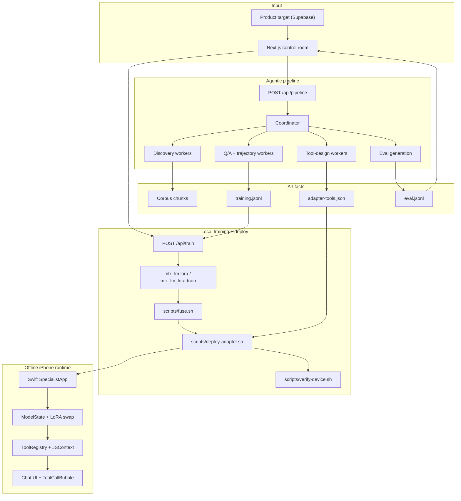
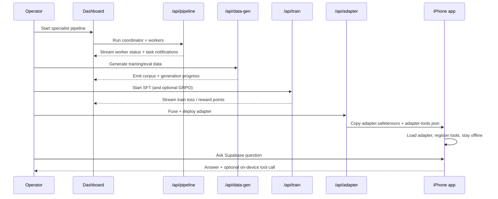

<h1 align="center">Offline Specialist LLM Pipeline</h1>

<p align="center">
  <strong>Agentic product-to-model pipeline: discovery swarm, dynamic tool design, judge-gated data generation, local MLX fine-tuning, and offline iPhone inference in one demo system</strong>
</p>

<p align="center">
  <a href="https://github.com/Julian-AT/codex-hackathon"></a>
  
  
  
</p>

## Overview

This project turns a product surface, currently **Supabase**, into a narrow specialist model that can run **fully offline on an iPhone**.

The system is intentionally end-to-end:

- a visible **coordinator/worker swarm** discovers the product surface and designs tool contracts
- a second pipeline generates **Q&A and tool-call trajectories**
- a local **MLX LoRA training loop** fine-tunes a Gemma 4 MLX base model on a MacBook
- the resulting adapter and its tool manifest are copied to a native **Swift + MLX** app
- the phone answers questions and executes tool calls while in **airplane mode**

The pitch thesis is simple:

> Cloud AI asks you to trust it. This one does not have to, because it cannot phone home.

## The challenge

Most "offline AI" demos quietly weaken the story with hidden retrieval, cloud fallback, or tiny web models. This repo goes after the harder version:

- domain-specialized behavior, not just generic chat
- agent-authored **dynamic JavaScript tools**, not hand-waved function calling
- local training on a consumer Mac
- native mobile inference, not a fragile browser path
- an explicit **fallback ladder** so the demo still works under pressure

## Core capabilities

| Track | What ships |
| --- | --- |
| **Swarm** | `/api/pipeline` coordinator/worker runtime, streamed worker status, live dashboard agent grid |
| **Discovery** | product corpus ingestion plus validated `adapter-tools.json` generation |
| **Data** | grounded Q&A, tool trajectories, eval-set generation, schema-gated tool-call examples |
| **Training** | local `mlx_lm.lora` SFT path, optional GRPO stage, streamed loss/reward telemetry, rollback safeguards |
| **Mobile runtime** | native Swift app, runtime adapter loading, tool-call parsing, JSContext tool execution, offline enforcement |
| **Demo ops** | fuse, deploy, verify, and preflight scripts for the stage path |

## Implementation: how it actually works

### System architecture



### End-to-end demo flow



### Training and mobile runtime

The training side is deliberately narrow and reliable:

- `scripts/train.sh` runs the SFT path for the MLX LoRA adapter
- `scripts/grpo.sh` is available, but the system can ship an **SFT-only** adapter when the RL stage is not worth the risk
- `/api/train` streams structured training points into the dashboard chart
- supervisor and rollback utilities protect against divergence and preserve a shippable checkpoint

The mobile runtime is equally explicit:

- `ModelState.swift` owns base-model lifetime and adapter swaps
- `GemmaToolParser.swift` intercepts streamed tool-call tokens
- `ToolRegistry.swift` executes bundled JavaScript tool bodies in `JavaScriptCore`
- `AdapterToolsLoader.swift` reloads `adapter-tools.json` on every adapter change
- `ChatView.swift` and `ToolCallBubble.swift` expose tool activity in the UI

### Why native iPhone instead of browser inference

The project intentionally avoids a web runtime path for the final mobile experience. The product story depends on a real offline phone, stable local inference, adapter hot-swap, and controlled tool execution. That is why the stack uses:

- **MLX** for training on macOS
- **MLX Swift** for iPhone inference
- **JavaScriptCore** for dynamic tool execution
- **USB-C deploy + hot-swap** instead of cloud-hosted inference

## Control room

The dashboard is the operator surface for the demo:

- live swarm state and task notifications
- readiness summary and pipeline health
- training chart with SFT and reward overlays
- quick eval and adapter actions
- deploy, verify, and preflight controls
- links into observability and demo evidence

This is not just a toy chat screen. It is meant to feel like a compact mission-control surface for getting from product target to mobile specialist model.

## Technology stack

| Layer | Choices |
| --- | --- |
| **App** | Next.js 15 App Router, React 19, TypeScript |
| **Agent runtime** | AI SDK v6, streamed UI message parts, coordinator/worker orchestration |
| **Providers** | Google and OpenAI in the current demo path; Anthropic is optional and not required for the core flow |
| **Validation** | Zod, AJV, `jsonschema`, `acorn`, `node:vm` |
| **Training** | `mlx-lm`, `mlx-lm-lora`, shell wrappers under `scripts/` |
| **Mobile** | SwiftUI, MLX Swift LM, JavaScriptCore, Network |
| **Charts/UI** | shadcn/ui, Tailwind CSS v4, Recharts |
| **Quality** | TypeScript, Vitest, shell verification |

## Prerequisites

- Node 20+
- `pnpm`
- Python 3.12 with the MLX CLIs available for the training path
- Xcode 16 and iOS 18+ for the device runtime
- A physical iPhone for the full offline mobile demo
- API keys for the generation and evaluation providers you want to use

## Setup

```bash
pnpm install
cp .env.example .env.local
pnpm dev
```

Open the dashboard at `http://localhost:3000`.

## Environment variables

See [`.env.example`](.env.example) for the full list. The most important ones are:

| Variable | Role |
| --- | --- |
| `OPENAI_API_KEY` | OpenAI judge / generation surfaces |
| `GOOGLE_GENERATIVE_AI_API_KEY` | Gemini discovery and data generation path |
| `ANTHROPIC_API_KEY` | Optional compatibility path only; not needed for the Google/OpenAI demo path |
| `SENTRY_DSN`, `NEXT_PUBLIC_SENTRY_DSN` | Observability |
| `EVAL_BASE_URL`, `EVAL_TUNED_URL` | External eval endpoints if you wire them |
| `NEXT_PUBLIC_IPHONE_UDID` | `devicectl` target |
| `NEXT_PUBLIC_BUNDLE_ID` | App container target for adapter deploys |

## Fast demo path

If you want the shortest route from repo to pitch:

1. Start the control room.
2. Run the data generation pipeline.
3. Train the adapter with SFT.
4. Stage and deploy the adapter to the phone.
5. Verify the device and record the mobile proof.

```bash
pnpm dev
curl -N -X POST http://localhost:3000/api/data-gen -H 'content-type: application/json'
bash scripts/train.sh
bash scripts/fuse.sh --no-fuse
bash scripts/deploy-adapter.sh
bash scripts/verify-device.sh
bash scripts/preflight-demo.sh
```

## Key scripts

| Script | Purpose |
| --- | --- |
| `scripts/train.sh` | MLX SFT entrypoint |
| `scripts/grpo.sh` | Optional GRPO stage |
| `scripts/fuse.sh` | Build fused or adapter-only payloads |
| `scripts/deploy-adapter.sh` | Copy adapter + tools to the iPhone app container |
| `scripts/verify-device.sh` | Record device verification state |
| `scripts/preflight-demo.sh` | Capture final demo checklist state |

## Project layout

```text
app/
  api/pipeline/        Coordinator/worker orchestration route
  api/data-gen/        Training/eval data generation route
  api/train/           MLX training subprocess route
  api/eval/            Three-way eval entrypoint
  api/adapter/         Fuse and deploy actions
  (demo)/              Dashboard page, stream hooks, charts, agent cards
components/dashboard/  Professional control-room UI
ios/SpecialistApp/     Offline iPhone app, adapter loading, tool runtime
lib/discovery/         Corpus discovery workers
lib/data/              QA/trajectory generation workers and schemas
lib/training/          Supervisor, rollback, transforms
lib/eval/              Eval harness types and runner
scripts/               Train, fuse, deploy, verify, preflight helpers
data/                  Generated datasets, adapter payloads, state artifacts
```

## Demo tiers

The repo is built around an explicit fallback ladder:

- **Tier 1**: live swarm, live training, live deploy, live offline phone
- **Tier 2**: live swarm and training, pre-run deploy or evaluation surface
- **Tier 3**: prerecorded phone cassette with live narration

That fallback structure is not accidental. It is part of the product discipline of making the offline story survive demo pressure.

## Current focus

The current target is a **Supabase specialist**. The architecture is intentionally reusable for other product surfaces, but the strongest path today is:

- Supabase corpus discovery
- Supabase tool manifest generation
- Supabase training/eval data
- Supabase-focused on-device proof

<p align="center">
  Built for <strong>OpenClaw Hack_001</strong> - Vienna - agents, training loops, and an airplane-mode iPhone
</p>
